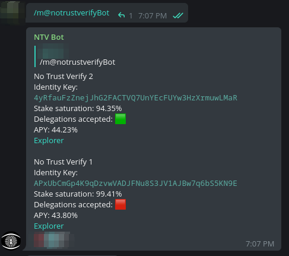

# NTV Bot

## Pre-requisites

- docker
- docker-compose
- Telegram bot

Follow this [doc](https://core.telegram.org/bots#6-botfather) about how to create a bot

## Example



## Getting started

```bash
git clone https://github.com/notrustverify/nymfrench-bot.git
cd ntv-bot
cp .env.example .env

```
In `.env` file, modify the value `TELEGRAM_TOKEN` by the token generated from [Botfather](https://t.me/botfather)

Start the bot `docker compose up -d --build`


### Add your nodes

In `data/nodes.json`, add the identity key and name like the example below

```json
{
"mixnodes": [
  {
    "idkey": "4yRfauFzZnejJhG2FACTVQ7UnYEcFUYw3HzXrmuwLMaR",
    "name": "No Trust Verify 2"
  },
  {
    "idkey": "APxUbCmGp4K9qDzvwVADJFNu8S3JV1AJBw7q6bS5KN9E",
    "name": "No Trust Verify 1"
  }
  ]
}
```

